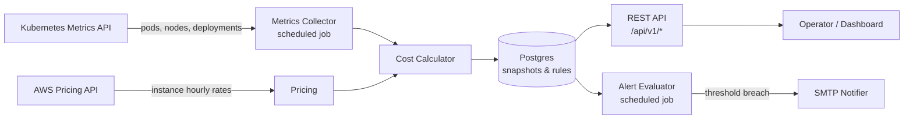

# Kubescope

**A self-hosted observability and cost-attribution service for Kubernetes clusters running on AWS.**

Kubescope connects to a Kubernetes cluster via the official Java client, collects pod- and node-level resource usage from the Metrics API, joins it against live AWS EC2 on-demand pricing, and exposes a REST API for cost breakdowns by namespace and deployment. Threshold-based alerts notify operators by email when costs or resource pressure cross configurable limits.

> This repository contains the **backend service**. The companion dashboard UI lives at [iraelie251006/kubescope-frontend](https://github.com/iraelie251006/kubescope-frontend).

[](https://github.com/iraelie251006/kubescope/actions/workflows/ci.yml)


---

## Why this exists

Commercial Kubernetes cost-visibility tools (Kubecost, CloudHealth, Datadog Cloud Cost) start in the hundreds of dollars per cluster per month and assume an enterprise procurement cycle. Small teams running EKS still need to answer the same questions — *which namespace is burning the budget? which deployment owns that idle node? are we about to blow our monthly spend?* — without the seat license. Kubescope is the minimal backend that answers those questions, designed to be self-hostable in the cluster it observes.

---

## Architecture



| Layer | Responsibility |
|-------|----------------|
| **Collector** | Polls the Kubernetes Metrics API on a configurable interval; persists node, pod, and namespace snapshots. |
| **Pricing** | Resolves EC2 on-demand pricing from the AWS Pricing API, with a bundled fallback JSON when the API is unavailable. |
| **Cost Calculator** | Joins resource usage with instance pricing to produce per-namespace and per-deployment cost attribution. |
| **Alerting** | Evaluates user-defined threshold rules on a schedule and dispatches email notifications with a cooldown window. |
| **Auth** | JWT access tokens with refresh-token rotation (reuse-detection via token families) stored in Postgres. |

---

## Tech stack

- **Java 25**, **Spring Boot 4.0.6** (WebMVC, Data JPA, Security, Validation, Actuator, Mail)
- **PostgreSQL 17** with **Flyway** migrations
- **Spring Data Redis** for ephemeral session and rate-limit data
- **Kubernetes Java client 22.0.0** (`io.kubernetes:client-java`)
- **AWS SDK v2** (`pricing` module) with on-disk fallback
- **JJWT 0.13** for access/refresh JWTs
- **Micrometer + Prometheus** for application metrics
- **JUnit 5 + Mockito + AssertJ + MockMvc + H2** for testing
- **Docker** multi-stage build (Spring Boot layertools), GitHub Actions CI

---

## Features

- Scheduled metrics collection from any reachable Kubernetes cluster (in-cluster service account or kubeconfig path).
- Per-namespace and per-deployment cost attribution against live EC2 pricing.
- Threshold alerts on cost or resource metrics with configurable cooldown and email delivery.
- JWT authentication with refresh-token rotation and reuse detection (rotated families are revoked on suspected theft).
- Admin bootstrap on first boot from environment variables.
- Flyway-managed schema with four migrations covering users, snapshots, alerts, and refresh-token families.
- Prometheus endpoint at `/actuator/prometheus` exposing cluster, namespace, and pod-phase gauges (not just JVM/HTTP metrics) — see [Monitoring](#monitoring-with-prometheus--grafana).
- Bundled Prometheus + Grafana stack via `docker-compose.yml`, with an auto-provisioned "Kubescope Overview" dashboard.

---

## REST API

| Method | Path | Purpose |
|--------|------|---------|
| `POST` | `/api/v1/auth/register` | Create a user; returns access + refresh cookies. |
| `POST` | `/api/v1/auth/login` | Exchange credentials for cookies. |
| `POST` | `/api/v1/auth/refresh` | Rotate the refresh token; revokes the family on reuse. |
| `POST` | `/api/v1/auth/logout` | Revoke the current refresh family. |
| `GET`  | `/api/v1/cluster/overview` | Node count, pod count, total hourly cost. |
| `GET`  | `/api/v1/cluster/nodes` | Latest node snapshot list. |
| `GET`  | `/api/v1/cluster/namespaces` | Latest cost breakdown by namespace. |
| `GET`  | `/api/v1/cluster/deployments` | Latest deployment snapshot list. |
| `GET`  | `/api/v1/metrics/history` | Historical snapshots for charting. |
| `GET`  | `/api/v1/alerts` | List configured alert rules. |
| `POST` | `/api/v1/alerts` | Create an alert rule. |
| `DELETE` | `/api/v1/alerts/{id}` | Delete an alert rule. |

OpenAPI/Swagger UI is on the roadmap (see [Project status](#project-status)).

---

## Quickstart

### Pull the prebuilt image from Docker Hub

```bash
docker pull technura/kubescope:latest
```

Tagged immutable builds (`technura/kubescope:sha-<commit>`) are also pushed on every merge to `main`.

### Run locally with Docker Compose

```bash
git clone https://github.com/iraelie251006/kubescope
cd kubescope
docker compose up --build
```

The API listens on `http://localhost:3000`. Postgres is provisioned automatically.

By default Kubescope reads `~/.kube/config` for cluster access. To point it at a specific kubeconfig, set `KUBECONFIG_PATH` in `docker-compose.yml`. To disable cluster polling for a dry-run, set `COLLECTOR_ENABLED=false`.

`docker compose up` also brings up Redis (session/rate-limit store), Prometheus, and Grafana alongside Postgres and the API — see [Monitoring](#monitoring-with-prometheus--grafana) below.

### Run from source

```bash
./mvnw spring-boot:run
```

Requires JDK 25, a reachable Postgres, and either a kubeconfig file or `IN_CLUSTER=true` when running as a pod with a service account.

---

## Monitoring with Prometheus & Grafana

`docker compose up` starts a full observability stack alongside the API:

| Service | URL | Notes |
|---------|-----|-------|
| Kubescope API | http://localhost:3000 | `/actuator/prometheus` is the scrape target. |
| Prometheus | http://localhost:9091 | Pre-configured with a single scrape job (`kubescope`), 15s interval. |
| Grafana | http://localhost:3001 | Login `admin` / `admin` (change it — see `GF_SECURITY_ADMIN_PASSWORD` in `docker-compose.yml`). The Prometheus datasource and a "Kubescope Overview" dashboard are provisioned automatically; no manual setup required. |

Config for the stack lives under `monitoring/`:

```
monitoring/
├── prometheus/prometheus.yml                        # scrape config
└── grafana/
    ├── provisioning/datasources/datasource.yml       # Prometheus datasource
    ├── provisioning/dashboards/dashboards.yml         # dashboard provider
    └── dashboards/kubescope-overview.json             # the dashboard itself
```

### Custom metrics

Beyond the JVM/HTTP metrics Spring Boot Actuator exposes by default, Kubescope publishes the same data it persists to Postgres as Micrometer gauges/counters on every collector run, so Prometheus and Grafana see live cluster state:

| Metric | Type | Labels | Description |
|--------|------|--------|--------------|
| `kubescope_cluster_nodes` / `_pods` / `_namespaces` | gauge | — | Counts observed in the latest collection cycle. |
| `kubescope_cluster_cpu_usage_millicores` / `_cpu_capacity_millicores` | gauge | — | Cluster-wide CPU usage and capacity. |
| `kubescope_cluster_memory_usage_bytes` / `_memory_capacity_bytes` | gauge | — | Cluster-wide memory usage and capacity. |
| `kubescope_cluster_cpu_usage_percent` / `_memory_usage_percent` | gauge | — | Usage as a percentage of capacity. |
| `kubescope_cluster_hourly_cost_usd` / `_monthly_cost_usd` | gauge | — | Estimated cluster cost. |
| `kubescope_namespace_cpu_usage_millicores` / `_memory_usage_bytes` / `_pods` / `_monthly_cost_usd` | gauge | `namespace` | Per-namespace breakdown. |
| `kubescope_pods_by_phase` | gauge | `phase` | Pod count grouped by lifecycle phase (`Running`, `Pending`, etc). |
| `kubescope_alerts_fired_total` | counter | `metric_type` | Incremented each time an alert rule fires. |

Namespace and pod-phase series are pruned once their key stops appearing in a collection cycle, so removed namespaces don't leave stale series behind.

Anonymous scraping is intentional: `/actuator/health/**`, `/actuator/info`, and `/actuator/prometheus` are permitted without auth in `SecurityConfig` so Prometheus doesn't need credentials — don't expose the API publicly without a reverse proxy in front of it.

---

## Configuration

All configuration is environment-variable driven.

| Variable | Default | Purpose |
|----------|---------|---------|
| `SPRING_DATASOURCE_URL` | — | JDBC URL for Postgres. |
| `SPRING_DATASOURCE_USERNAME` | — | DB username. |
| `SPRING_DATASOURCE_PASSWORD` | — | DB password. |
| `REDIS_HOST` | — | Redis hostname. |
| `REDIS_PORT` | — | Redis port. |
| `JWT_SECRET` | placeholder | Base64-encoded HS256 signing key. **Override in production.** |
| `JWT_EXPIRY_HOURS` | `24` | Access-token lifetime. |
| `JWT_REFRESH_EXPIRY_DAYS` | `30` | Refresh-token lifetime. |
| `KUBECONFIG_PATH` | empty (fall back to `~/.kube/config`) | Path to a kubeconfig file. |
| `IN_CLUSTER` | `false` | Use the in-cluster service account when running as a pod. |
| `COLLECTOR_ENABLED` | `true` | Toggle the scheduled metrics collector. |
| `METRICS_COLLECTION_INTERVAL_SECONDS` | `60` | Collector interval. |
| `AWS_PRICING_API_ENABLED` | `false` | Hit the live AWS Pricing API; falls back to bundled JSON when `false`. |
| `AWS_REGION` | `us-east-1` | Region used for pricing lookups. |
| `ALERTS_ENABLED` | `true` | Toggle the alert evaluator. |
| `ALERT_EVALUATION_INTERVAL_SECONDS` | `300` | Evaluator interval. |
| `ALERT_COOLDOWN_MINUTES` | `60` | Minimum gap between repeated notifications for the same rule. |
| `ALERT_FROM_EMAIL` | `alerts@kubescope.io` | `From:` header on outgoing alerts. |
| `SMTP_HOST` / `SMTP_PORT` / `SMTP_USER` / `SMTP_PASSWORD` | `localhost` / `587` / empty / empty | Outbound mail relay. |
| `ADMIN_EMAIL` / `ADMIN_PASSWORD` | empty | Seeded admin account on first boot. |

---

## Development

### Run the test suite

```bash
./mvnw test
```

Tests run against in-memory H2 (Postgres compatibility mode) — no Docker required. The integration tier (`@SpringBootTest`) boots the full Spring context with Kubernetes, Redis, and SMTP stubbed via `IntegrationTestSupport`.

### Test coverage

- `@DataJpaTest` repository tests for each aggregate.
- `@SpringBootTest + MockMvc` controller tests for auth, alerts, cluster, and metrics endpoints.
- End-to-end `AuthFlowIntegrationTest` covering register → login → cookie issuance.
- Unit tests for the collector, pricing, cost calculator, alert evaluator, email notifier, and JWT service.

### Database migrations

Flyway migrations live in `src/main/resources/db/migration/`. Schema changes require a new `V{n}__description.sql` file; never edit an applied migration.

---

## Project status

This is a backend service under active development. Honest state of the world:

**Working today**
- Metrics collection, pricing resolution, cost calculation, alert evaluation, JWT auth with refresh rotation, Flyway-managed schema, Docker image, GitHub Actions CI.
- Companion dashboard frontend at [kubescope-frontend](https://github.com/iraelie251006/kubescope-frontend).

**On the roadmap**
- OpenAPI / Swagger UI documentation.
- Helm chart for in-cluster deployment on EKS.
- Cost forecasting based on historical snapshots.
- Slack and PagerDuty notifiers in addition to email.
- Multi-cloud pricing (GCP, Azure) — currently AWS-only.

Issues and PRs welcome.

---

## License

MIT — see `LICENSE`.

## Author

Built by [Niyubwayo Irakoze Elie](https://github.com/iraelie251006).
